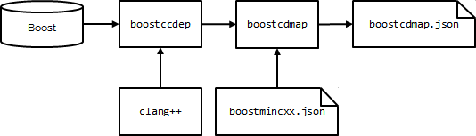

# Boost condicional dependency map

Part of the [Boost epoch proposal](https://github.com/joaquintides/boost_epoch/).
The tool [`boostcdmap`](#boostcdmap) has been to used to generate a [`boostcdmap.1.73.0.json`](boostcdmap.1.73.0.json)
file describing the internal dependencies of every Boost module for epochs **Boost03** to
**Boost20**.

## How does map generation work



* [`boostccdep`](#boostccdep) analyzes the internal dependencies of Boost modules
using Clang preprocessor with configurable values of `BOOST_ASSUME_CXX` and `-std`.
* [`boostcdmap`](#boostcdmap) reads the mininum C++ standard version requirements
of Boost modules from [`boostmincxx.1.73.0.json`](boostmincxx.1.73.0.json) and uses
`boostccdep` to scan the dependencies of each module for its supported epoch
confgurations.

Calculated dependencies are in general fewer than those listed in the
[Boost dependency report](https://pdimov.github.io/boostdep-report/) (including
primary and secondary dependencies): this is so because `boostcdmap`/`boostccdep`
recognizes conditional header inclusion based on environment macros (such as
those of **Boost.Config**).

[Full map generation](.travis.yml) takes around 35 min on a regular (as of 2020) Travis Ubuntu box.

## boostccdep
```
usage: boostccdep.py [-h] [-b <path-to-boost>] -std <std> [-D <pp-symbol>]
                     [-v]
                     <compiler> <module>
positional arguments:
  <compiler>            compiler command name (vg. clang++)
  <module>              Boost module name
optional arguments:
  -h, --help            show this help message and exit
  -b <path-to-boost>, --boost-root <path-to-boost>
                        path to Boost (default uses BOOST_ROOT environment variable)
  -std <std>            C++ standard version used
  -D <pp-symbol>        predefined preprocessor symbol (can be used multiple times)
  -v, --verbose         verbose mode
```
**&lt;compiler&gt;**

Name of a C++ compiler driver with GCC-compatible command line interface
(that is, GCC or Clang).

**&lt;module&gt;**

Name of the Boost module to be inspected.

**-b \[--boost-root \] &lt;path-to-boost&gt;**

Path to an installation of modular Boost. If this option is not provided, the program
uses the environment variable `BOOST_ROOT`. It is not necessary that the installation
has its headers collected under a common `boost` subdir via `b2 headers`. 

**-std &lt;std&gt;**

Passed to the compiler for C++ standard version specification.

**-D &lt;pp-symbol&gt;**

Predefined preprocessor symbol, either as  `-DSYMBOL` or `-DSYMBOL=VALUE`.
This command option can be repeated to define multiple symbols.

**-v \[--verbose\]**

When in verbose mode, scanned file names in the module are shown. 

## boostcdmap
```
usage: boostcdmap.py [-h] [-b <path-to-boost>] <mincxx-info-file>
positional arguments:
  <mincxx-info-file>    path to JSON file with info on min C++ requirements for Boost libs
optional arguments:
  -h, --help            show this help message and exit
  -b <path-to-boost>, --boost-root <path-to-boost>
                        path to Boost (default uses BOOST_ROOT environment variable)
```
**&lt;mincxx-info-file&gt;**

JSON file indicating the minimum C++ standard version required for each Boost module.
If a module does not appear, C++03 compatibility is assumed. Look at
[`boostmincxx.1.73.0.json`](boostmincxx.1.73.0.json) for an example of such file.

**-b \[--boost-root \] &lt;path-to-boost&gt;**

Path to an installation of modular Boost. If this option is not provided, the program
uses the environment variable `BOOST_ROOT`. It is not necessary that the installation
has its headers collected under a common `boost` subdir via `b2 headers`. 
